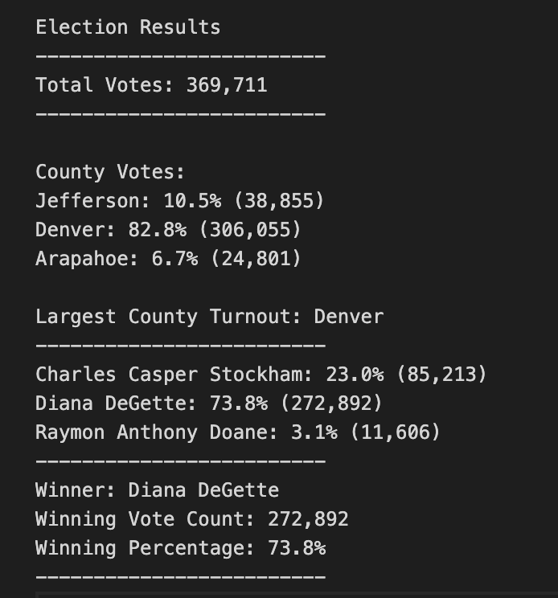

# Election_Analysis

## Project Overview
A Colorado Board of Elections employee has given you the following tasks to complete the election audit of a recent local congressional election.

1. Calculate the total number of votes cast.
2. Get a complete list of candidates who received votes.
3. Calculate the total number of cotes each candidate received. 
4. Calculate the percentage of votes each candidate won.
5. Determine the winner of the election based on popular vote.

## Resources
- Data Source: election_results.csv
- Software: Python 3.6.1, Visual Studio Code, 1.38.1

## Summary 
The analysis of the elecition show that:

By using Python we were able to create a script that would write and read our election data. We used different calculations on the counts, along with loops and conditional statements. At the end of the report we were able to determine our analysis on the election. 

- There were 369,711 votes cast in the election
- The candidates were:
   - Charles Casper Stockham 
   - Diana Degette
   - Raymon Anthony Doane
- The candidate results were:
   - Charles Casper Stockham received 23.0% of the vote and 85,213 votes.
   - Diana Degette received 73.8% of the vote and 272,892 votes.
   - Raymon Anthony Doane received 3.1% of the vote and 11,606 votes. 
- The winner of the election was:
   - Diana Degette, who received 73.8% of the vote and 272,892 votes.
   
 ## Challenge Overview
The election commission requested additional data to complete the audit which included; the voter turnout for each county, the percentage of votes from each county of the total count, and the county with the highest turnout.

## Election-Audit Results:
- How many votes were cast in this congressional election?
   - Total Votes: 369,711
- Provide a breakdown of the number of votes and the percentage of total votes for each county in the precinct.
   - County Votes:
   - Jefferson: 10.5% (38,855)
   - Denver: 82.8% (306,055)
   - Arapahoe: 6.7% (24,801)
- Which county had the largest number of votes?
   - Denver
- Provide a breakdown of the number of votes and the percentage of the total votes each candidate received.
   - Charles Casper Stockham received 23.0% of the vote and 85,213 votes.
   - Diana Degette received 73.8% of the vote and 272,892 votes.
   - Raymon Anthony Doane received 3.1% of the vote and 11,606 votes. 
- Which candidate won the election, what was their vote count, and what was their percentage of the total votes?
   - Diana Degette, who received 73.8% of the vote and 272,892 votes.
   
 ## Challenge Summary
 Colorado had three counties that made up 369,711 votes. Denver is the largest county with 82.8% of the votes. After we finished running our code for the    three candidates we were able to determine that Diana DeGette, with 73.8% of the 369,711 votes is the overall winner. We could use this same thod to dive even deeper. We could use this to see what counties favored which candidates and possibly how many people out of these counties didn't even vote and factor that into our data. 

The finalized outline report can be found in the analysis folder named election_analysis.txt.

### 
